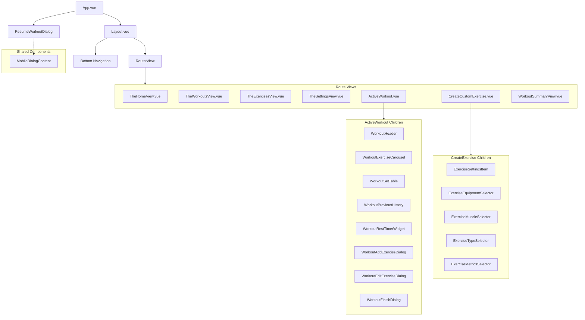

# CLAUDE.md

This file provides guidance to Claude Code (claude.ai/code) when working with code in this repository.

before you add any new ui code think if there is something that we can
use from vue shadecn.

before you write any custom code think if there is something from 
vueUse that could help you.

## Code Style

Follow the conventions in @TYPESCRIPT_STYLE_GUIDE.md for all TypeScript code.

## Project Overview

**workoutTracker** is a Vue 3 + Vite web application with TypeScript support. It uses:
- **Frontend**: Vue 3 (Composition API), Vue Router, Pinia (state management)
- **Styling**: Tailwind CSS v4 with Vite plugin
- **UI Components**: shadcn/ui (Vue), Lucide Icons
- **Testing**: Vitest (unit tests), Playwright (e2e tests)
- **Linting**: ESLint (flat config) with Oxlint, Prettier
- **Build Tool**: Vite (rolldown-vite)

## Development Commands

### Core Commands
- `pnpm dev` - Start dev server with hot module reload
- `pnpm build` - Type-check + build for production (runs type-check and build-only in parallel)
- `pnpm preview` - Preview production build locally

### Testing
- `pnpm test:unit` - Run Vitest unit tests (auto-watches in dev)
- `pnpm test:e2e` - Run Playwright e2e tests (requires built project first)
- `pnpm test:e2e --debug` - Run e2e tests in debug mode
- `pnpm test:e2e tests/example.spec.ts` - Run specific e2e test file

### Code Quality
- `pnpm lint` - Run all linters (oxlint + eslint) with auto-fix
  - `pnpm lint:oxlint` - Run oxlint only with fixes (enabled rules: correctness)
  - `pnpm lint:eslint` - Run eslint only with fixes
- `pnpm type-check` - TypeScript type checking via vue-tsc
- `pnpm format` - Format source files with Prettier

## Architecture

### Directory Structure
- **`src/`** - Main source directory
  - **`components/`** - Vue components (organized by feature)
    - **`ui/`** - Reusable UI component library (button, etc.)
  - **`stores/`** - Pinia stores for state management
  - **`router/`** - Vue Router configuration (currently empty routes)
  - **`lib/`** - Utility functions and helpers
  - **`__tests__/`** - Unit tests co-located with features
  - **`App.vue`** - Root component
  - **`main.ts`** - Entry point (app setup, plugin initialization)
  - **`style.css`** - Global styles with Tailwind imports

### Build Configuration
- **`vite.config.ts`** - Vite config with Vue, Tailwind, and DevTools plugins
- **`vitest.config.ts`** - Vitest config (jsdom environment, excludes e2e tests)
- **`eslint.config.ts`** - ESLint flat config (Vue, TypeScript, Vitest, Playwright, Oxlint)
- **`playwright.config.ts`** - Playwright e2e test configuration
- **`tsconfig.json`** - Base TypeScript config with path alias `@/*` → `src/*`
  - **`tsconfig.app.json`** - App-specific TS settings
  - **`tsconfig.node.json`** - Node/build tool TS settings
  - **`tsconfig.vitest.json`** - Vitest-specific TS settings

### Path Aliases
- `@/*` resolves to `src/*` (configured in vite and tsconfig)

### Key Configuration Files
- **`.prettierrc.json`** - Prettier formatting rules
- **`components.json`** - Component library metadata (shadcn/ui)
- **`.editorconfig`** - Cross-editor settings

## Important Setup Notes

- **Package Manager**: Uses pnpm@9.9.0 (locked version in package.json)
- **Node Version**: Requires Node ^20.19.0 or >=22.12.0
- **TypeScript Version**: ~5.9.0
- **Playwright Setup**: Must run `npx playwright install` before first e2e test run
- **Type Checking**: Uses `vue-tsc` (not standard tsc) to properly handle `.vue` files

## State Management

The project uses Pinia with the Composition API setup pattern. Example in `src/stores/counter.ts`:
- Stores are defined as factory functions with `defineStore()`
- Use `ref()` for reactive state, `computed()` for derived state
- Export functions for mutations and actions
- Access stores with composition API hooks like `useCounterStore()`

## Component Architecture

### Component Hierarchy

### shadcn/ui Components
- UI components live in `src/components/ui/` using the shadcn/ui library (Vue version)
- **IMPORTANT**: When building features, always try to use shadcn components first before creating custom components
- If a needed component doesn't exist, **install it from shadcn/ui first** using the shadcn CLI before implementing
- This keeps the codebase consistent and maintainable with well-tested, accessible components

### Custom Components
- Feature components can be organized by route/feature in `src/components/` (not in `ui/`)
- Only create custom components when shadcn doesn't have a suitable component available
- Components use `<script setup>` syntax (Composition API shorthand)
- Styling uses Tailwind utility classes and can use `clsx` + `tailwind-merge` for dynamic classes

### MobileDialogContent
- Use `MobileDialogContent` from `@/components/MobileDialogContent.vue` instead of `DialogContent` for dialogs
- Displays as a bottom sheet on mobile (< 640px) and centered dialog on desktop
- Drop-in replacement for `DialogContent` with the same props and slots

### Component Naming Conventions
Follow the Vue.js Style Guide for component names:
- **File names**: Always use PascalCase (e.g., `WorkoutHeader.vue`, not `workout-header.vue`)
- **Tightly-coupled components**: Prefix with parent component name to make relationships explicit
  - Example: If `ExerciseCarousel` only belongs to Workout, name it `WorkoutExerciseCarousel.vue`
  - This groups related files alphabetically and clarifies dependencies
- **Full-word names**: Avoid abbreviations (e.g., `ExerciseTypeSelector` not `ExerciseTypeSelect`)
- **Component imports**: Use PascalCase in all imports (e.g., `import WorkoutHeader from '...'`)
- **Template usage**: Use PascalCase in templates (e.g., `<WorkoutHeader />`)

**Anti-patterns to avoid:**
- ❌ Generic names without context: `Timer.vue`, `Selector.vue`
- ❌ Mixed casing: `workoutTimer.vue` or `WorkoutTimer.vue` in different files
- ❌ Vague abbreviations: `WH.vue`, `EC.vue`

## Linting & Formatting

- **Oxlint** runs on TypeScript/JavaScript with `correctness` rules enabled
- **ESLint** uses flat config (native ESLint v9+ format)
- **Prettier** is configured via skip-formatting in ESLint (prevents conflicts)
- Run `pnpm lint` to auto-fix both oxlint and eslint issues
- Run `pnpm format` to format code with Prettier
