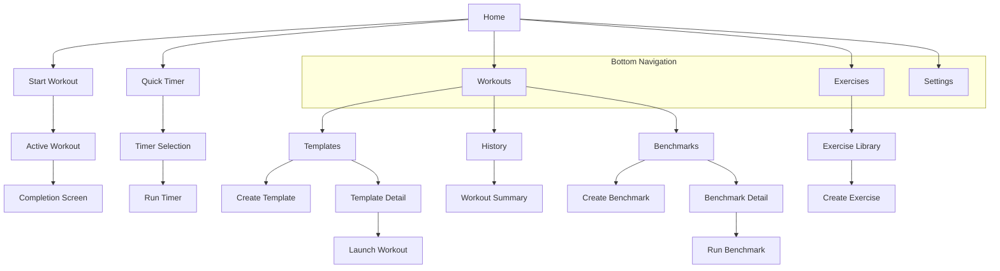
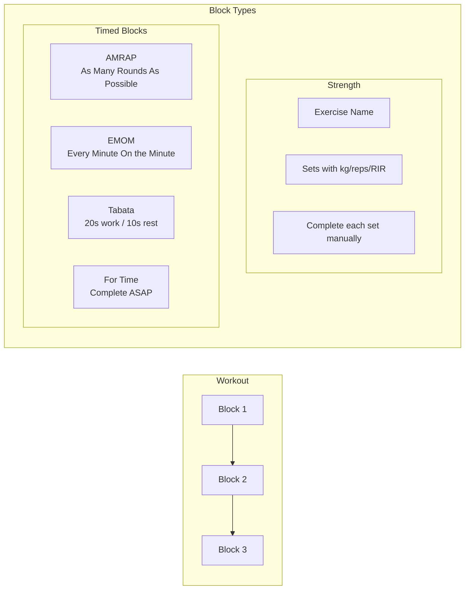
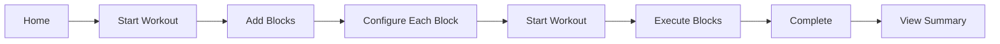
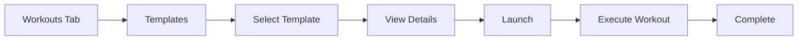
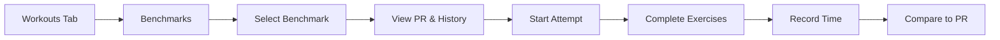
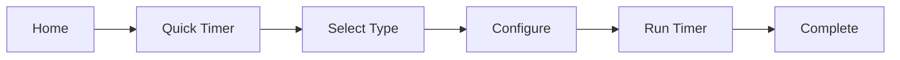
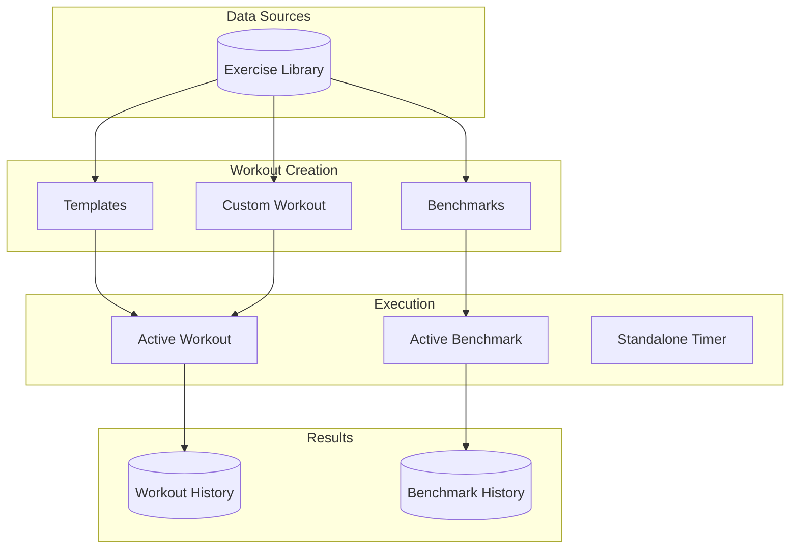

## Workout Tracker - Product Features

A Progressive Web App for strength training and CrossFit workout tracking.

## Overview

### What It Does

- Track strength workouts with sets, reps, weight, and RIR (Reps in Reserve)
- Execute CrossFit-style timed workouts (AMRAP, EMOM, Tabata, For Time)
- Save and reuse workout templates
- Track benchmark workouts with personal bests and split times
- Use standalone timers for any training session

### Key Capabilities

- **Offline-first**: All data stored locally, works without internet
- **Block-based workouts**: Mix strength exercises and timed blocks in one session
- **Auto-save**: Never lose workout progress
- **Resume workouts**: Pick up where you left off
- **Personal records**: Track PRs on benchmark workouts

### Platform

- Progressive Web App (installable on mobile/desktop)
- Works offline after first load
- Data persists in browser storage

---

## App Navigation

---

## Features

### 1. Workout Execution

**Purpose**: Build and execute custom workouts combining strength exercises and timed blocks.

**Capabilities**:

- Add strength exercises from library with customizable sets
- Add timed blocks (AMRAP, EMOM, Tabata, For Time)
- Reorder blocks via drag-and-drop
- Track weight (kg/lbs), reps, and RIR for each set
- Real-time duration timer during workout
- Rest timer between sets/blocks
- Auto-save progress every second
- Resume interrupted workouts
- View workout summary with stats after completion

**User Flow**:

1. Tap "Start Workout" from Home
2. Add blocks (strength exercises or timed blocks)
3. Reorder and configure as needed
4. Tap "Start" to begin
5. Complete each block sequentially
6. View completion screen with total duration
7. Optionally view detailed summary

### 2. Exercise Library

**Purpose**: Browse, search, and manage exercises for use in workouts.

**Capabilities**:

- Pre-loaded exercise database
- Search by exercise name
- Filter by muscle group (Chest, Back, Legs, Shoulders, Arms, Core)
- Create custom exercises with:
  - Name and icon
  - Equipment type (9 options)
  - Primary muscle group
  - Exercise type (compound, isolation, stability, cardio)
  - Measurement type (weight+reps, reps only, duration, etc.)

**Equipment Types**:
| Equipment | Description |
|-----------|-------------|
| Barbell | Standard barbell exercises |
| Dumbbell | Single or paired dumbbells |
| Kettlebell | Kettlebell movements |
| Machine | Gym machines |
| Cable | Cable machine exercises |
| Bodyweight | No equipment needed |
| Band | Resistance bands |
| EZ-Bar | Curved barbell |
| Hex-Bar | Trap bar exercises |

### 3. Templates

**Purpose**: Save workout patterns for quick reuse.

**Capabilities**:

- Name templates for easy identification
- Add multiple exercises in order
- Set default set count per exercise (1-10)
- Reorder exercises
- Edit or delete templates
- Launch template to start a new workout instantly

**User Flow**:

1. Navigate to Workouts > Templates tab
2. Tap "Create Template"
3. Name the template and add exercises
4. Save template
5. Later: Select template and tap "Start" to launch

### 4. Benchmarks

**Purpose**: Track performance on standardized workouts over time.

**Capabilities**:

- Create benchmark workouts (e.g., "Cindy", "Fran", "Diane")
- Two benchmark types:
  - **For Time**: Complete exercises as fast as possible
  - **Rounds**: Complete multiple rounds with fixed exercises
- Track personal best times
- Compare split times to previous attempts
- View complete attempt history
- See real-time comparison during workout

**User Flow**:

1. Navigate to Workouts > Benchmarks tab
2. Create or select a benchmark
3. View personal best and attempt history
4. Tap "Start" to run benchmark
5. Tap through exercises as you complete them
6. View final time and comparison to PR

### 5. Timers

**Purpose**: Standalone timers for any training session.

**Timer Types**:

| Timer        | What It Does                   | Tracks                          |
| ------------ | ------------------------------ | ------------------------------- |
| **AMRAP**    | Counts down from set duration  | Rounds + partial reps completed |
| **EMOM**     | Alerts at each minute boundary | Completed/missed minutes        |
| **Tabata**   | Alternates work/rest intervals | Reps per round                  |
| **For Time** | Counts up with optional cap    | Time to completion              |

**Capabilities**:

- Configure duration/rounds/intervals
- Add exercises to display during timer
- Audio cues at transitions
- Pause/resume functionality
- Volume control

**User Flow**:

1. Tap "Quick Timer" from Home (or Timers view)
2. Select timer type
3. Configure duration and exercises
4. Run timer
5. Exit when complete

### 6. Settings

**Purpose**: Customize app behavior and manage data.

**Available Settings**:

| Section         | Setting         | Options                                 |
| --------------- | --------------- | --------------------------------------- |
| **Appearance**  | Dark Mode       | On/Off                                  |
|                 | Language        | English, German                         |
| **Units**       | Weight          | kg, lbs                                 |
|                 | Height          | cm, ft/in                               |
| **Screen**      | Keep Screen On  | On/Off (prevents sleep during workouts) |
|                 | Timer Sounds    | On/Off                                  |
|                 | Timer Volume    | 50-100%                                 |
| **Data**        | Export Data     | Download all data as JSON               |
|                 | Import Data     | Restore from JSON backup                |
| **Danger Zone** | Delete All Data | Permanently erase everything            |

---

## Workout Block Types

### Strength Block

- Traditional weight training
- Track: weight, reps, RIR per set
- User marks each set complete
- Auto-advances to next set

### AMRAP Block

- Timed circuit (e.g., 15 minutes)
- User performs exercises continuously
- Records: total rounds + partial reps
- Timer counts down

### EMOM Block

- Fixed duration (e.g., 10 minutes)
- Perform reps at start of each minute
- Rest until next minute starts
- Tracks completed vs missed minutes

### Tabata Block

- 8 rounds default (customizable)
- 20 seconds work + 10 seconds rest
- Tracks reps per round
- Audio cues for transitions

### For Time Block

- Complete prescribed work ASAP
- Optional time cap
- Records completion time
- Split time tracking available

---

## User Workflows

### Quick Custom Workout

### Template-Based Workout

### Benchmark Tracking

### Standalone Timer

---

## Feature Relationships

---

## Data Storage

All data is stored locally on the user's device:

- **Exercises**: Custom exercise definitions
- **Templates**: Saved workout patterns
- **Benchmarks**: Benchmark definitions and attempt history
- **Workout History**: Completed workout records
- **Active Workout**: In-progress workout state (auto-saved)
- **Settings**: User preferences

Data can be exported/imported as JSON for backup and transfer between devices.
