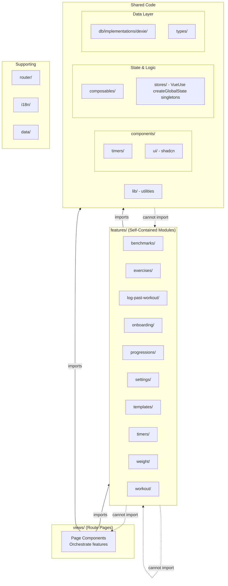
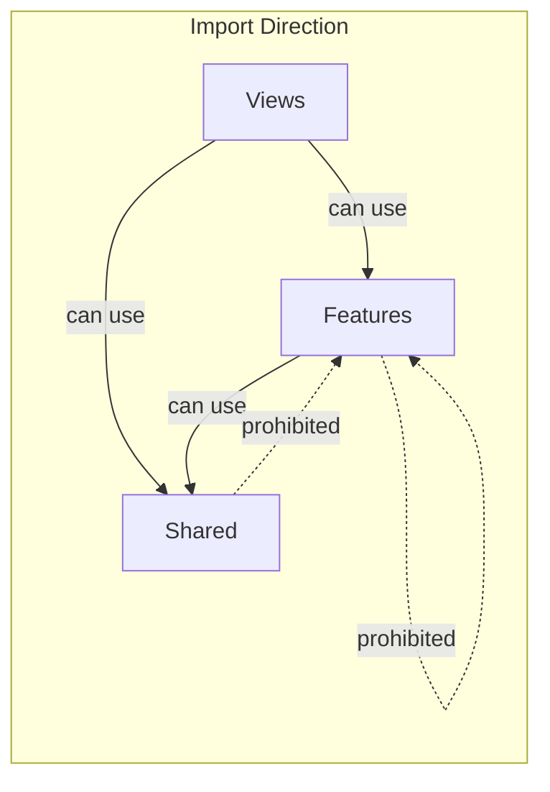

# Architecture Overview

Vue 3 PWA using **Bulletproof feature-based architecture** for strength and CrossFit-style workout tracking.

## Folder Structure Diagram



## Dependency Rules



## Layer Responsibilities

| Layer | Purpose | Import Rules |
|-------|---------|--------------|
| `views/` | Route-level pages | Can import features + shared |
| `features/` | Self-contained modules | Can only import shared, NOT other features |
| `components/` | Reusable UI components | Cannot import features |
| `composables/` | Shared reactive logic | Cannot import features |
| `stores/` | VueUse createGlobalState singletons (exercises.ts, settings.ts, toast.ts) + plain-ref singleton (workoutState.ts) | Cannot import features |
| `db/` | Dexie + repository pattern | Cannot import features |

## Directory Structure

```
src/
├── features/               # Self-contained feature modules (Bulletproof pattern)
│   ├── benchmarks/         # Benchmark workouts tracking
│   ├── exercises/          # Exercise library CRUD
│   ├── log-past-workout/   # Logging workouts after the fact
│   ├── onboarding/         # First-run onboarding flow
│   ├── progressions/       # Strength progressions
│   ├── settings/           # App settings & preferences
│   ├── templates/          # Workout templates
│   ├── timers/             # Standalone timer UI components
│   ├── weight/             # Bodyweight tracking
│   └── workout/            # Workout execution logic
├── views/              # Route-level page components (orchestrate features)
├── components/         # Shared components
│   ├── timers/         # Timer UI components
│   └── ui/             # shadcn-vue primitives (DO NOT EDIT)
├── composables/        # Shared composables (timers, animations, utilities)
│   └── timers/         # Timer composables (rest, AMRAP, EMOM, etc.)
├── stores/             # VueUse createGlobalState singletons + plain-ref singleton
│   ├── exercises.ts    # createGlobalState — exercise library state
│   ├── settings.ts     # createGlobalState — app settings state
│   ├── toast.ts        # createGlobalState — ephemeral toast/confirmation messages
│   └── workoutState.ts # plain-ref singleton — active workout state
├── db/                 # Dexie IndexedDB + repository pattern
│   └── implementations/dexie/   # Data access layer (concrete repository implementations)
├── types/              # Shared TypeScript types
├── lib/                # Utility functions
├── router/             # Vue Router configuration
├── i18n/               # Internationalization
│   └── messages/       # Translation files
└── data/               # Static data
```

## Key Principles

1. **Feature Isolation**: Features cannot import from other features (ESLint-enforced)
2. **Unidirectional Dependencies**: Views → Features → Shared
3. **Shared Code Neutrality**: Shared code cannot depend on features
4. **Single Responsibility**: Each feature owns its domain logic
